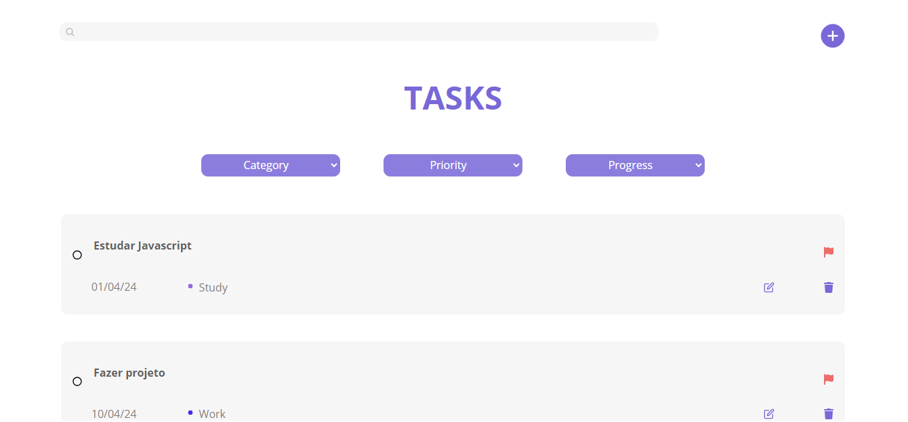

<h1>
  
  &nbsp;
  TaskPlan - Gerenciador de Tarefas
</h1>

O TaskPlan é um projeto React JS que visa oferecer uma solução eficiente e intuitiva para o gerenciamento de tarefas. Com ele é possível criar, editar, excluir, pesquisar e filtrar tarefas com facilidade, tornando o processo de organização mais simples e eficaz.

## Objetivo

O principal objetivo do TaskPlan é oferecer uma ferramenta prática e eficaz para o gerenciamento de tarefas diárias, projetos ou qualquer outra atividade que exija uma abordagem organizada. Ao fornecer recursos como criação, edição, exclusão, pesquisa e filtragem de tarefas, o TaskPlan visa aumentar a produtividade e facilitar o acompanhamento do progresso das atividades.

Acesse-o através deste link: [TaskPlan](https://gabibento.github.io/TaskPlan).

## Tecnologias Utilizadas

- React JS
- HTML
- CSS
- JavaScript

## Recursos Principais

- **Criação de Tarefas:** Os usuários podem criar novas tarefas, atribuindo detalhes como título, data, categoria e prioridade.
  
- **Edição de Tarefas:** É possível editar as informações das tarefas existentes, permitindo ajustes conforme necessário.
  
- **Exclusão de Tarefas:** Pode-se remover tarefas que não são mais relevantes ou necessárias.
  
- **Pesquisa de Tarefas:** O TaskPlan oferece uma função de pesquisa para encontrar rapidamente tarefas pelo seu título.
  
- **Filtragem de Tarefas:** Também é possível filtrar suas tarefas pela sua categoria, prioridade e progresso, para facilitar a visualização e o acompanhamento.

- **Conclusão de Tarefas:** Há, além disso, a funcionalidade de marcar as tarefas como concluídas, podendo visualizar seu progresso. Da mesma forma, é possível desmarcar tarefas concluídas, permitindo ajustes e acompanhamento contínuo.
  
- **Design Responsivo:** O TaskPlan possui um design responsivo, adaptando-se a diferentes tamanhos de telas

## Organização de tarefas

### Categorias
As tarefas no TaskPlan podem ser categorizadas em três categorias: "Work", "Study" e "Personal". Essa separação é importante para permitir que os usuários classifiquem suas tarefas de acordo com o contexto em que elas se encaixam, facilitando a priorização e o gerenciamento.

### Prioridades
Além disso, as tarefas são atribuídas a uma das três prioridades disponíveis: "Urgent", "Important" e "Upcoming". Essa divisão de prioridades é importante para identificar rapidamente o grau de importância de cada tarefa.

### Progresso

As tarefas podem estar completas ou incompletas. Essa divisão permite ao usuário acompanhar facilmente o status de suas tarefas e identificar aquelas que ainda precisam ser concluídas.

### Data

Cada tarefa no TaskPlan possui uma data associada. Assim podendo agendar suas tarefas de acordo com prazos específicos, facilitando o planejamento e a organização das atividades, oferecendo um gerenciamento melhor de tempo e prioridades.

## Integração Simulada

O TaskPlan utiliza uma integração simulada, hospedada no Firebase, para simular o backend do aplicativo. Essa integração permite uma experiência completa de uso, possibilitando testar todas as funcionalidades do aplicativo de gerenciamento de tarefas.

## Conclusão

- No desenvolvimento do TaskPlan, pude adquirir valiosos aprendizados que certamente irão contribuir para o meu crescimento profissional e pessoal. Ao longo do processo, fui desafiada a aplicar meus conhecimentos em React JS, assim como em HTML, CSS e JavaScript, para criar uma aplicação funcional e intuitiva. O desenvolvimento do TaskPlan também me permitiu aprimorar minhas habilidades de organização e resolução de problemas, me fazendo aprender mais com cada desafio. Foi uma oportunidade enriquecedora de colocar em prática o que aprendi e de continuar expandindo meu conhecimento e habilidades na área de desenvolvimento de software.
- Estou sempre aberta à críticas, colaborações e novas oportunidades de aprendizado no mundo da tecnologia!
